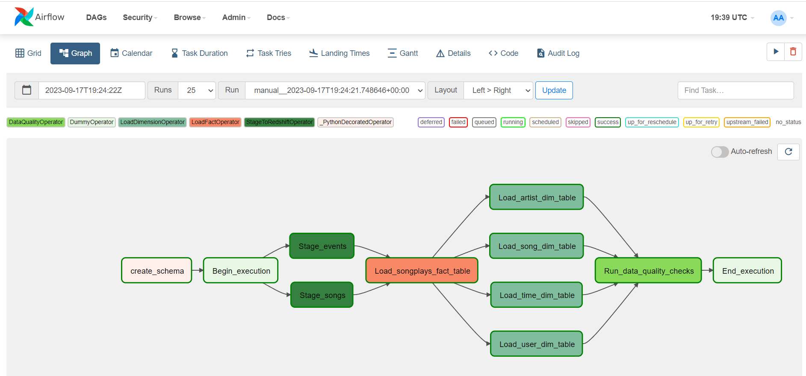

# Data-Pipelines-with-Airflow

## Contents

+ [Project Discription](#Project-Discription)
+ [Project Datasets](#Project-Datasets)
+ [Database](#Database)
+ [Project Files](#Project-Files)

---

### Project Discription

In this project I created an ETL pipeline that extracts data from the Amazon's S3 store and loads it into the Amazon Redshift PostreSQL database using Apache Airflow for scheduling and monitoring the ETL workflow.

---

## Project Datasets

* Song data: 's3://udacity-dend/song_data'  
* Log data: 's3://udacity-dend/log_data'

---
### Database 

The database uses the same schema as in my previous Data Warehousing project: https://github.com/ibrahimmoursy/Data-Warehousing.

### DAG

The Airflow DAG will be configurated according to the following guidelines:

 - The DAG does not have dependencies on past runs
 - On failure, the task are retried 3 times
 - Retries happen every 5 minutes
 - Catchup is turned off
 - Do not email on retry

### Project Files 
This project workspace includes 2 folders:

dags Folder

  
+ [final_project.py](dags/final_project.py) - This file contains the main DAG as well as all the imports, tasks and task dependencies.
+ [set_connections.sh](dags/set_connections.sh) - This script sets up the connection with aws and redshift for the airflow project, by saving the aws_credentials, redshihft connections to airflow and variables to the airflow enviroment.

plugins Folder

  
+ [sql_files](plugins/sql_files) - This folder has all the sql statement used in this project.
+ [stage_redshift.py](plugins/stage_redshift.py) - Airflow operator class for extracting data from S3 into the Redshift staging table.
+ [load_fact.py](plugins/load_fact.py) - Airflow operator class for loading data into the fact table.
+ [load_dimension.py](plugins/load_dimension.py) - Airflow operator class for loading data into the dimension table.
+ [data_quality.py](plugins/data_quality.py) - Airflow operator class for data quality check.

 

---

